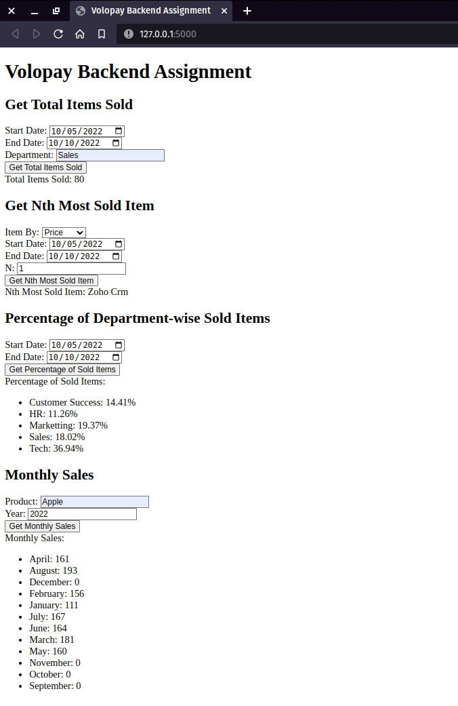

---

# Assignment for Volopay Banckend Internship

APi developed using Flask and Pandas. 

## Prerequisites

- Python 3
- Flask framework
- Pandas library

## Usage

1. Start the Flask API server by running the following command in the project directory:

   
   flask run
   

   The server should now be running on `http://localhost:5000`.

2. Open your web browser and navigate to `http://localhost:5000` to access the HTML user interface.

   - *Total Items Sold API*: Enter the start date, end date, and department to get the total number of items sold in the specified date range and department.

   - *Nth Most Sold Item API*: Enter the item by (quantity or price), start date, end date, and N value to get the nth most sold item based on the specified parameters.

   - *Percentage of Department-wise Sold Items API*: Enter the start date and end date to get the percentage of sold items (seats) for each department.
   
   - *Monthly Sales API*: Enter the product and year to get the monthly sales for the specified product.

3. Fill in the required parameters in the respective forms and click the corresponding buttons to make API requests. The results will be displayed on the web page.

## File Structure

- `app.py`: The Flask application file containing the API endpoints and server configuration.
- `data.csv`: The dataset file containing the purchase information.
- `templates/index.html`: The HTML file providing the user interface for interacting with the API endpoints.
- `README.md`: The readme file explaining the project and its usage.

## Screenshot of web api

